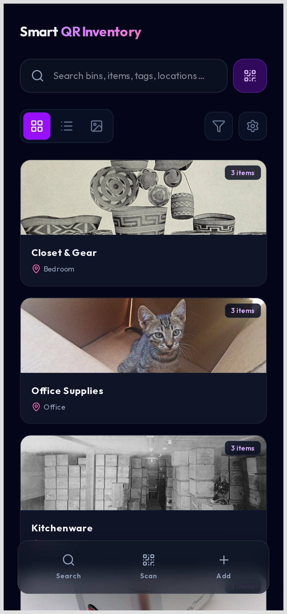
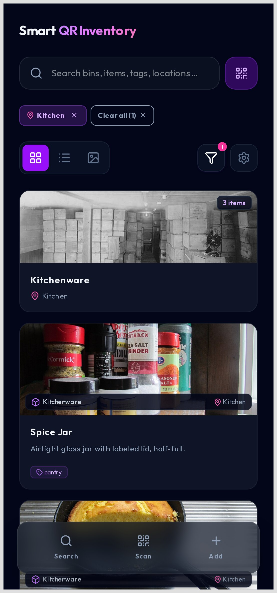
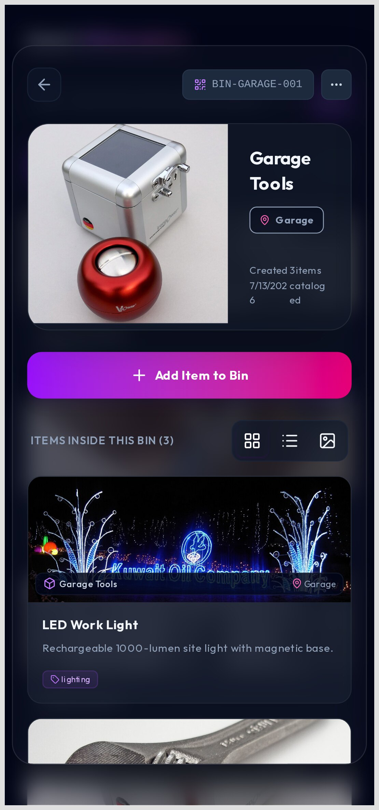
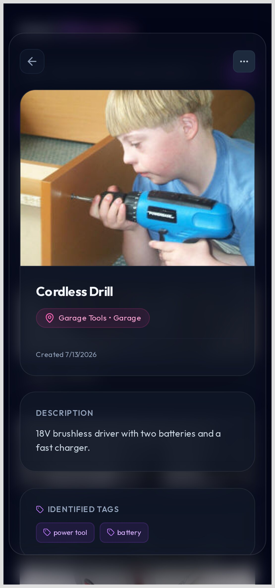
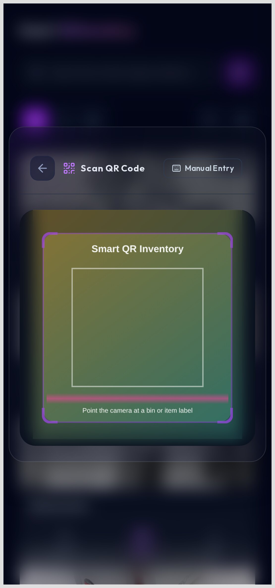
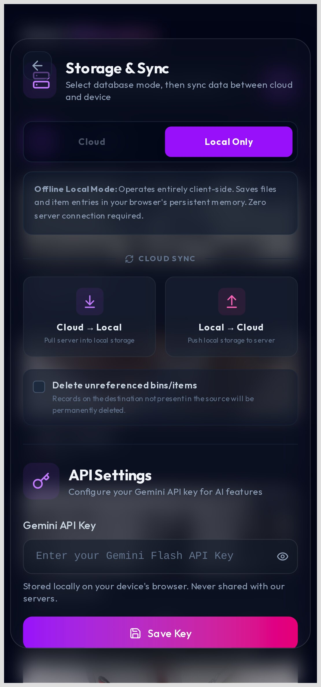

# Smart QR Inventory

> **Your stuff, labeled and findable.** Scan a QR code and see exactly what is in the bin — no accounts, no cloud, no guessing where you put the drill.

Smart QR Inventory is a mobile-first app for keeping track of physical things: tools,
kitchenware, cables, camping gear, anything you store in boxes and bins. You print or
stick a QR label on each container, snap photos of what goes inside, and later scan the
label to pull up the full contents in seconds. It runs **entirely on your device**, so it
works offline — on the workshop shelf, in the basement, or anywhere the signal does not
reach — and it builds into a native **Android app** you can install straight from an APK.

## A quick look

| | |
|---|---|
|  |  |
|  |  |
|  |  |

*Screenshots show a sample inventory (tools, kitchenware, office supplies, and gear)
created for demonstration.*

## Why you'll like it

- **Label once, find forever.** Generate a QR code for any bin or item and print it on a
  standard letter-size label sheet. Scan it to jump straight to that container.
- **Photos, not just text.** Capture bin and item photos with the camera (front or back),
  so you recognize things at a glance instead of decoding a name.
- **Search that actually works.** Full-text search across names, descriptions, tags, and
  locations — plus filters for location, tag, bin, and whether a photo or field is present.
- **Offline-first.** Everything lives on your device by default. No sign-up, no server, no
  internet required. (Optional self-hosted sync is available if you want it.)
- **Never lose the history.** Every change is recorded, and you can roll back to any
  previous state or cherry-pick individual bins and items to restore.
- **Back up and move on.** Export your whole inventory — including images — to a single
  zip, and restore it on another device in one step.
- **Let AI do the typing.** Drop an item photo into the optional AI analysis and it will
  suggest a name, description, and tags for you to approve field by field.

## How it works

1. **Create a bin** and print its QR label.
2. **Add items** to the bin — give each a name, tags, and a photo, or save it with just the
   bare essentials and fill in details later.
3. **Scan the label** whenever you need to know what is inside, or just **search** from the
   home screen.
4. **Back up** anytime, and **restore** on any device.

---

## For Developers

### Stack

- **Client**: React 19 + Vite + Tailwind CSS v4, served as a single-page app.
- **Server**: Node.js + Express + SQLite (via `sqlite`/`sqlite3`), with image
  processing through `sharp` and backup archives via `archiver`/`unzipper`.
- **Packaging**: multi-stage Docker image published to GitHub Container Registry.

### Repository layout

```
client/   # Vite/React front-end (PWA)
server/   # Express + SQLite back-end API
.github/  # CI (tests + build) and release (GHCR) workflows
```

### Prerequisites

- Node.js 22+ (the Docker image uses `node:22-slim`)
- npm 10+

### Development

Start the back-end (defaults to port `5005`):

```bash
cd server
npm install
npm run dev      # nodemon; or: npm start
```

Start the front-end (Vite dev server on port 5173):

```bash
cd client
npm install
npm run dev      # vite
```

The client talks to the API at `http://localhost:5005` (configured in the app).

### Environment

- `PORT` — server listen port (default `5005`)
- `GOOGLE_API_KEY` — optional; enables the Gemini image-analysis feature
  (it can also be set from the app's Settings screen)

### Testing

```bash
cd client && npm test    # vitest smoke tests
cd server && npm test    # node:test smoke tests
```

### Lint / build

```bash
cd client && npm run lint && npm run build
```

### Docker

Build the image locally (builds the client, then runs the server, which also
serves the built client from `client/dist`):

```bash
docker build -t smart-qr .
docker run -p 5005:5005 -v "$(pwd)/server/uploads:/app/uploads" smart-qr
```

Open `http://localhost:5005`.

### Container image (GHCR)

On each tagged release the image is published to `ghcr.io/nag-sh/smart-qr`:

```bash
docker pull ghcr.io/nag-sh/smart-qr:latest
```

Images are private, matching the private repository.

### Android (local build)

The client can also be packaged as an Android app using [Capacitor](https://capacitorjs.com/).

#### Prerequisites

- [Android Studio](https://developer.android.com/studio) (latest stable)
- JDK 17+
- Android SDK with `cmdline-tools` and a recent platform / build-tools (set `ANDROID_HOME`)

#### Build commands

One-shot debug build from the repo root:

```bash
npm run --prefix client android:build
```

This runs:

1. `npm run build:mobile` — build the client with `vite.mobile.config.js` (base `./`)
2. `cap sync android` — copy the web bundle into `client/android`
3. `cd android && ./gradlew assembleDebug` — produce a debug APK

Other useful scripts (run from `client/` or via `npm --prefix client`):

```bash
npm run android:sync   # build mobile + cap sync android
npm run android:open   # sync and open the project in Android Studio
```

#### Release signing

Generate a release keystore once and store it securely (do not commit it):

```bash
keytool -genkey -v -keystore smartqr-release.keystore -alias smartqr -keyalg RSA -keysize 2048 -validity 10000
```

Base64-encode the keystore for use in CI:

```bash
base64 -w 0 smartqr-release.keystore > smartqr-release.keystore.b64
```

#### GitHub Secrets for release workflow

The GitHub Actions release workflow expects the following repository secrets:

- `KEYSTORE_BASE64` — base64-encoded release keystore
- `KEYSTORE_PASSWORD` — keystore password
- `KEY_ALIAS` — key alias (e.g., `smartqr`)
- `KEY_PASSWORD` — key password

Set these in **Settings → Secrets and variables → Actions** before running a release workflow that signs an APK/AAB.

Pushing a Git tag matching `v*` (for example `git tag v1.2.3 && git push origin v1.2.3`) triggers `.github/workflows/android-release.yml`, which builds the signed release APK and attaches it to a GitHub release for that tag.

### Data & persistence

- `server/inventory.db*` — SQLite database (runtime; not committed)
- `server/uploads/` — uploaded item images (runtime; not committed)

Mount a volume at `/app/uploads` and persist `inventory.db` for durable data.

### Contributing

This repository requires **all changes to go through a pull request** — direct
commits and pushes to `main` are blocked. Because GitHub branch protection is
unavailable on a Free private repository, this is enforced client-side with
[husky](https://typicode.github.io/husky/) git hooks (installed automatically
on `npm install` via the root `prepare` script):

- `.husky/pre-commit` — refuses to commit while on `main`
- `.husky/pre-push` — refuses to push directly to `main`

Workflow: create a feature branch, commit, push the branch, and open a PR.
CI (client lint + tests + build, server tests, and a Docker build check)
validates every PR before merge.

> Note: the hooks run as part of `git`, so they can be bypassed with
> `--no-verify`. For a hard server-side block, upgrade the `nag-sh` org to
> GitHub Team/Pro (which enables required-PR branch protection on private repos).

---

## Demo image credits

The sample inventory shown in the screenshots uses freely licensed photographs from
[Wikimedia Commons](https://commons.wikimedia.org/). They are for demonstration only and
are not part of the application:

| Demo asset | Author | License |
|---|---|---|
| Garage bin, LED work light | Ralf Gruner / Noblevmy | CC BY-SA 4.0 / CC BY 3.0 |
| Kitchen bin | Frank H. Nowell | Public domain |
| Office bin | Revital Salomon | CC BY-SA 4.0 |
| Closet bin | Internet Archive Book Images | No restrictions |
| Cordless drill | Rob Kay | CC BY-SA 3.0 |
| Adjustable wrench | Batholith | Public domain |
| Ceramic mug | Stephen B Calvert | CC BY-SA 3.0 |
| Cast iron skillet | Douglas P Perkins | CC BY 3.0 |
| Spice jar | ParentingPatch | CC BY-SA 3.0 |
| Mechanical keyboard | Thanasis Termitzoglou | CC BY-SA 4.0 |
| Notebook | Pink Sherbet Photography | CC BY 2.0 |
| USB-C hub | Thefreeencyclopedia1 | CC BY-SA 4.0 |
| Running shoes | Matti Blume | CC BY-SA 4.0 |
| Canvas backpack | Unknown author | CC BY 4.0 |
| Desk lamp | Martin Falbisoner | CC BY-SA 4.0 |

Full source links are recorded in [`demo/demo-manifest.json`](demo/demo-manifest.json).
